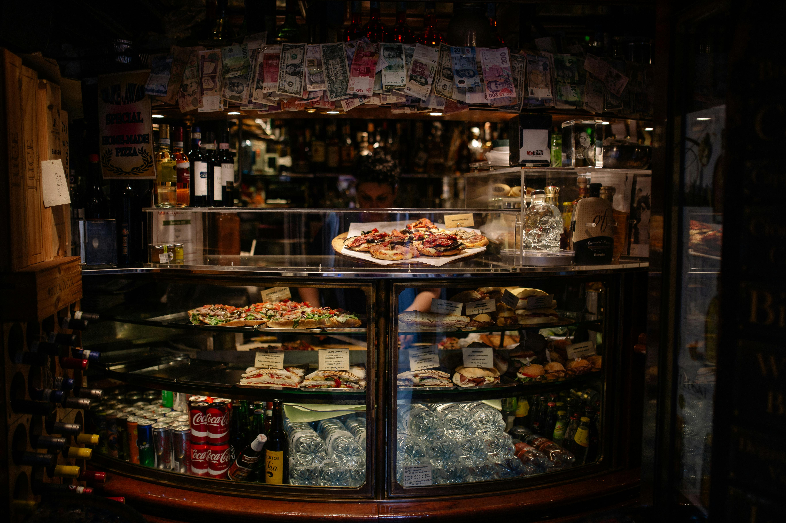
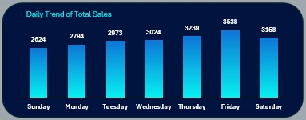
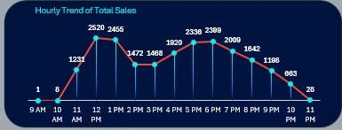
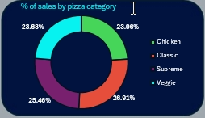
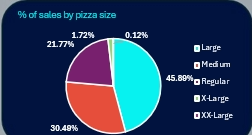
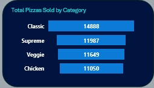
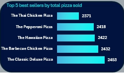
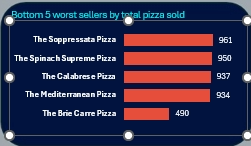
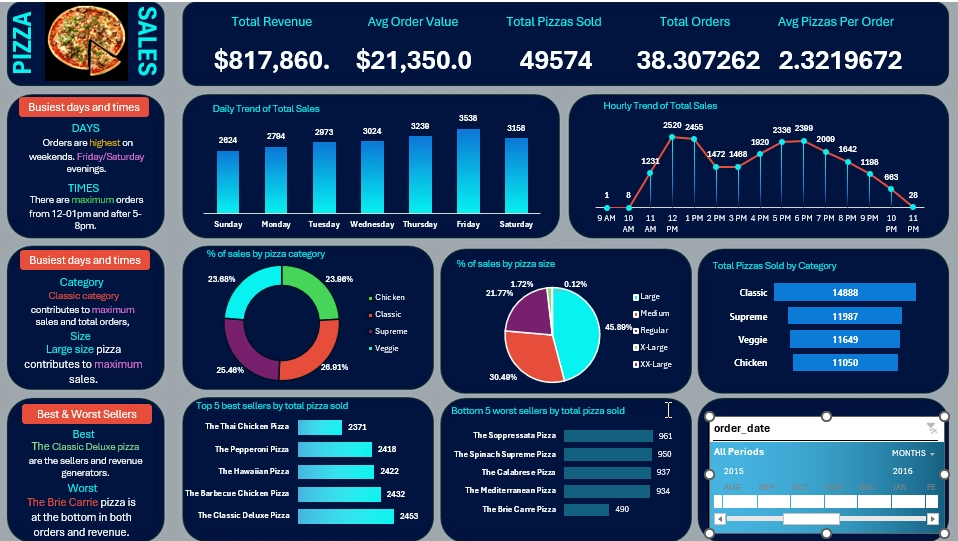

# Pizza-Sales-Report

# Introduction
This report analyzes pizza sales data, focusing on total revenue, average order value, daily and hourly trends, and category-wise performance. The aim is to provide insights into the busiest times, best and worst-performing items, and trends influencing sales.

**_Disclaimer_** : _All data set do not represent any company, institution or country, but just a dummy data set to demonstrate the capabilities of Excel._

## Problem Statement
The business seeks to understand:

1. What drives sales on different days and times.
2. Which categories and sizes contribute the most to revenue.
3. How to identify and optimize underperforming products.

## Data Sourcing
An imaginary data set.

## Data Transformation
The raw sales data underwent:

Aggregation: Metrics like total revenue, total pizzas sold, and average order value were computed.
Categorization: Sales were grouped by days, times, pizza categories, and sizes.
Visualization: Data was represented through bar graphs, pie charts, and line plots for better interpretation.

## Analysis and Visualization.
With the aid of pie charts, bar charts, and column graphs, I presented the total sales accordint to countries, coffee types and so on.Through this analysis, it was revealed that USA has the highest sales among the three countries.

### Daily Trends of Total Sales

  ---

  ### Hourly Trends of Total Sales

  ---

  ### Percentage of Sales by Category

  ---

  ### Percentage of Sales by Size

  ---

  ### Total Pizzas Sold by Category

  ---

   ### Top 5 Best Sellers

  ---

   ### Bottom 5 Worst Sellers

  ---

   ### Pizza Store Report

  ---

  # Conclusion
Key insights derived:

Busiest Days and Times: Sales peak on weekends, especially on Friday/Saturday evenings, and during lunch (12 PM–1 PM) and dinner hours (5 PM–8 PM).
Top Performing Categories: Classic pizzas generate the highest revenue, while large-size pizzas dominate sales by size.
Best and Worst Sellers: The Classic Deluxe Pizza is the top seller, whereas the Brie Carre Pizza performs the worst in sales.

# Recommendation
1. Optimize Weekend Operations: Increase staff and inventory on Fridays and Saturdays during peak hours to maximize revenue.
2. Promote Underperforming Items: Consider discounts or marketing campaigns for the Brie Carre Pizza and other low-sellers.
3. Capitalize on Best Sellers: Focus on advertising the Classic Deluxe Pizza and similar items to boost sales further.
4. Expand on Large Size Sales: Offer promotions or bundles on large pizzas to leverage their popularity.
5. Data-Driven Decision-Making: Continuously monitor sales patterns and adjust strategies to align with emerging trends.
THANK YOU 😄
